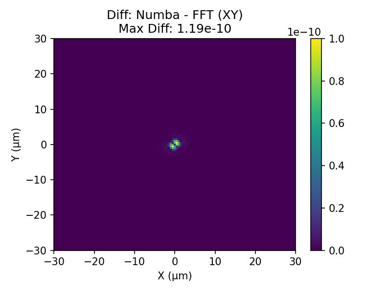
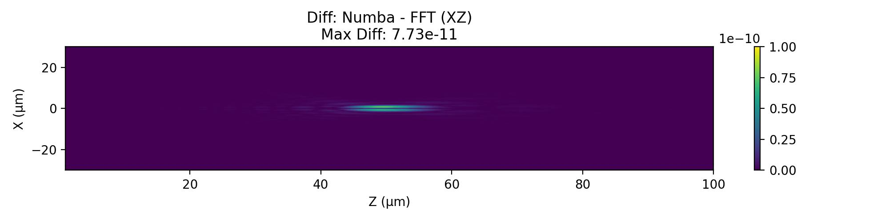
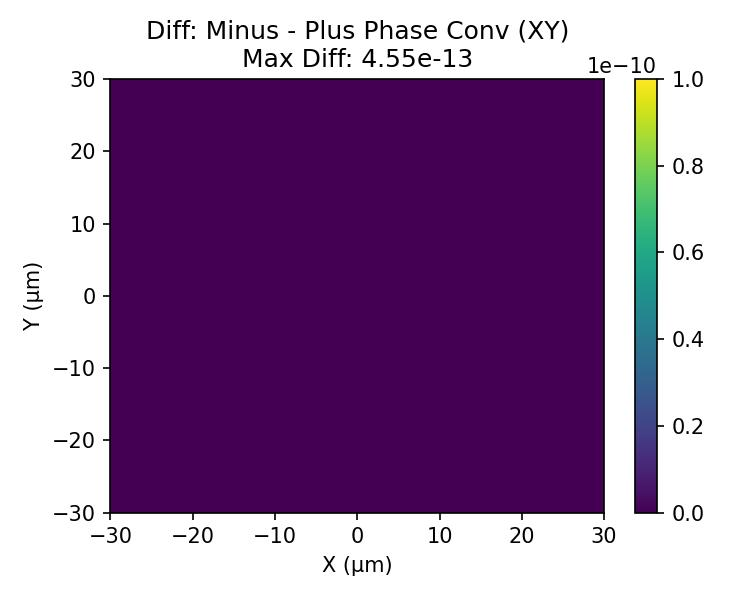
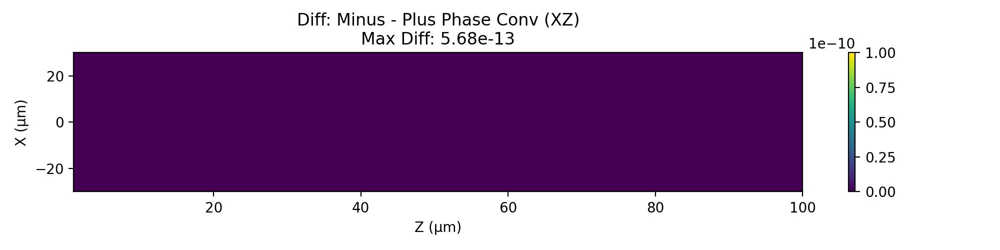
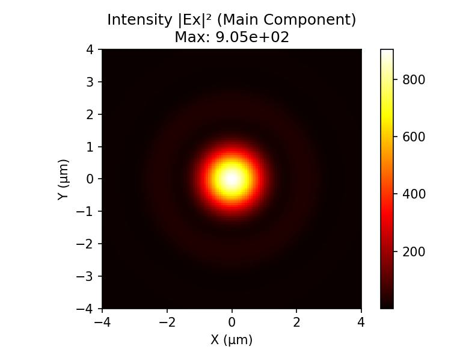
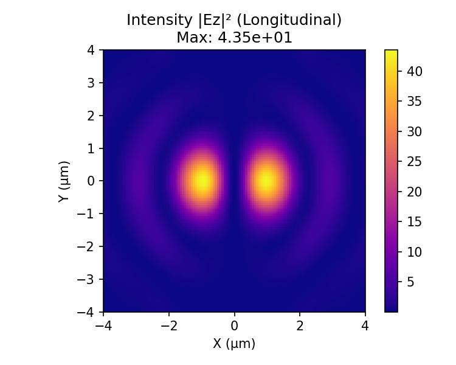
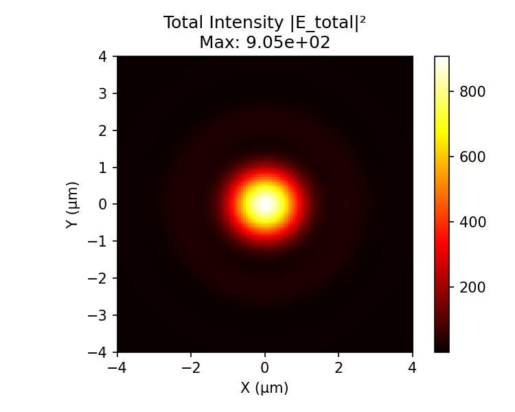

# 矢量角谱法 (Vector Angular Spectrum) 验证报告

本文档旨在验证基于矢量角谱衍射理论的 Python 传播函数的正确性与性能。验证场景设定为**近红外超透镜 (Metalens) 的点聚焦模拟**。角谱法通过分解空间频率 (Plane Wave Expansion) 进行严格传播，在处理非傍轴 (Non-paraxial)、高频倏逝波 (Evanescent waves) 时具有极高的理论精度。

### ⚙️ 仿真物理参数设置
* **工作波长 (λ)**: 1.55 μm
* **超透镜尺寸 (D)**: 60 μm × 60 μm
* **近场网格间距 (dx, dy)**: 0.5 μm (满足 ≤ λ/2 奈奎斯特采样定律)
* **设计焦距 (f)**: 50 μm (数值孔径 NA ≈ 0.51)
* **入射偏振态**: X 线偏振 (X-polarized)

---

## 💻 通用初始化代码 (Initialization)
在运行以下任意计算模式前，需要先构建近场物理网格与透镜参数。由于采用了大内存高性能服务器进行计算，所有测试模式均使用统一的高分辨率网格，**不进行任何降采样**，以确保结果的绝对一致性。角谱法的 FFT 模式要求远场网格与近场严格一致，而 Numba 模式则支持任意坐标点。

```python
import numpy as np
from LumAPI import AngularSpectrum_Vector

# 1. 物理参数定义
lamb = 1.55e-6
k = 2 * np.pi / lamb
D = 60e-6
dx = 0.5e-6
f_design = 50e-6

# 2. 构建近场网格
x_n = np.arange(-D/2, D/2, dx)
y_n = np.arange(-D/2, D/2, dx)
X_n, Y_n = np.meshgrid(x_n, y_n, indexing='xy')

# 3. 透镜圆形光阑截断与近场偏振初始化 (纯 X 偏振)
aperture = (X_n**2 + Y_n**2) <= (D/2)**2

# 4. 定义远场观察坐标轴
z_scan = np.linspace(1e-6, 100e-6, 200)       # Z轴扫描 (0 到 2f)
Ny, Nx = len(y_n), len(x_n)
```

---

## 📑 目录 (Table of Contents)
1. [第一组：正相位传播约定 (+)](#1-plus)
   - [1.1 FFT 快速傅里叶模式 (全空间瞬时计算)](#11-fft)
   - [1.2 Numba 连续逆傅里叶积分模式](#12-numba)
2. [第二组：负相位传播约定 (-)](#2-minus)
3. [第三组：误差分析与一致性验证](#3-diff)
   - [3.1 不同计算模式差值分析](#31-mode-diff)
   - [3.2 不同相位约定差值分析](#32-phase-diff)
4. [第四组：矢量衍射特性与 Numba 无级缩放分析](#4-feature)

---

<h2 id="1-plus">1. 第一组：正相位传播约定 (+)</h2>
<p>本组测试采用 <code>software='+'</code>，即空间相位传播项为 exp(+ikz)。设定近场输入为 <b>X 偏振</b> 光，因此仅对 X 分量施加负号聚焦相位，Y 分量设为 0。</p>

```python
phase_plus = -k * np.sqrt(X_n**2 + Y_n**2 + f_design**2)
E_near_x_plus = aperture * np.exp(1j * phase_plus)
E_near_y_plus = np.zeros_like(E_near_x_plus)
```

<h3 id="11-fft">1.1 FFT 快速傅里叶模式 (mode='f')</h3>
<p>利用传递函数 H(fx, fy) 进行极速卷积。一次调用即可返回全空间 3D 矩阵，提取中心切片可得完整的 Z 轴与 XZ 面分布。</p>

```python
# FFT模式要求 x_far, y_far 必须等于 x_near, y_near
E_tot_f, _, _, _ = AngularSpectrum_Vector(lamb, x_n, y_n, E_near_x_plus, E_near_y_plus, x_n, y_n, z_scan, mode='f', software='+')

# 提取各切面光强
I_z_axis_f = E_tot_f[Ny//2, Nx//2, :]**2
actual_f_idx_f = np.argmax(I_z_axis_f)
I_xy_f = E_tot_f[:, :, actual_f_idx_f]**2
I_xz_f = E_tot_f[Ny//2, :, :]**2
```

<table align="center">
  <tr>
    <td align="center">
      <br>
      <sup><b>图 1.1a:</b> Z轴分布。准确聚焦于 50 μm 附近。</sup>
    </td>
    <td align="center">
      <br>
      <sup><b>图 1.1b:</b> FFT 焦平面 (全尺寸视野)。</sup>
    </td>
  </tr>
  <tr>
    <td colspan="2" align="center">
      <br>
      <sup><b>图 1.1c:</b> FFT XZ 传播截面。全网格极速计算结果。</sup>
    </td>
  </tr>
</table>

<h3 id="12-numba">1.2 Numba 连续逆傅里叶积分模式 (mode='n')</h3>
<p>不依赖 IFFT，而是通过 JIT 并行显式计算角谱的连续反积分。针对焦点切面进行精确扫描，是数学上最严谨的对比基准。</p>

```python
# 针对特定切片坐标进行 Numba 离散化计算
E_tot_n_z, _, _, _  = AngularSpectrum_Vector(lamb, x_n, y_n, E_near_x_plus, E_near_y_plus, [0.0], [0.0], z_scan, mode='n', software='+')
actual_f_n = z_scan[np.argmax(E_tot_n_z[0, 0, :]**2)]

E_tot_n_xy, _, _, _ = AngularSpectrum_Vector(lamb, x_n, y_n, E_near_x_plus, E_near_y_plus, x_n, y_n, [actual_f_n], mode='n', software='+')
E_tot_n_xz, _, _, _ = AngularSpectrum_Vector(lamb, x_n, y_n, E_near_x_plus, E_near_y_plus, x_n, [0.0], z_scan, mode='n', software='+')
```

<table align="center">
  <tr>
    <td align="center">
      <br>
      <sup><b>图 1.2a:</b> Numba Z轴分布。</sup>
    </td>
    <td align="center">
      <br>
      <sup><b>图 1.2b:</b> Numba 焦平面分布。</sup>
    </td>
  </tr>
  <tr>
    <td colspan="2" align="center">
      <br>
      <sup><b>图 1.2c:</b> Numba XZ 传播截面。</sup>
    </td>
  </tr>
</table>

---

<h2 id="2-minus">2. 第二组：负相位传播约定 (-)</h2>
<p>本组测试采用 <code>software='-'</code>，即空间相位传播项为 exp(-ikz)。为了匹配该约定，超透镜的设计相位必须翻转为正：$\phi = +k \sqrt{x^2 + y^2 + f^2}$。得益于修复后的散度定理相位推导逻辑，不同约定下的矢量电场耦合将严格保持物理能量守恒。</p>

```python
# 生成负相位约定下的近场矢量电场 (注意相位正负号翻转)
phase_minus = k * np.sqrt(X_n**2 + Y_n**2 + f_design**2)
E_near_x_minus = aperture * np.exp(1j * phase_minus)
E_near_y_minus = np.zeros_like(E_near_x_minus)

# 显式指定 software='-' 使用 Numba 模式进行切片验证
E_tot_n_z_m, _, _, _  = AngularSpectrum_Vector(lamb, x_n, y_n, E_near_x_minus, E_near_y_minus, [0.0], [0.0], z_scan, mode='n', software='-')
E_tot_n_xy_m, _, _, _ = AngularSpectrum_Vector(lamb, x_n, y_n, E_near_x_minus, E_near_y_minus, x_n, y_n, [actual_f_n], mode='n', software='-')
E_tot_n_xz_m, _, _, _ = AngularSpectrum_Vector(lamb, x_n, y_n, E_near_x_minus, E_near_y_minus, x_n, [0.0], z_scan, mode='n', software='-')
```

<table align="center">
  <tr>
    <td align="center">
      <br>
      <sup><b>图 2.1a:</b> 负约定 Z 轴矢量光强。</sup>
    </td>
    <td align="center">
      <br>
      <sup><b>图 2.1b:</b> 负约定焦平面分布。结果不受数学符号干扰。</sup>
    </td>
  </tr>
  <tr>
    <td colspan="2" align="center">
      <br>
      <sup><b>图 2.1c:</b> 负约定 XZ 传播截面。相位流向已正确映射回实际物理空间。</sup>
    </td>
  </tr>
</table>

---

<h2 id="3-diff">3. 第三组：误差分析与一致性验证</h2>
<p>角谱法的两种模式：离散快速傅里叶反变换 (FFT) 与 显式连续积分 (Numba) 在数学上完全等价。同时，对算法底层进行的正负约定修正完美保证了最终能量场的一致性。</p>

<h3 id="31-mode-diff">3.1 不同计算模式差值分析</h3>
<p>下图展示了 Numba 与 FFT 计算同一平面时的绝对差值。由于 Colorbar 固定在极低量级 (<code>1e-10</code>)，画面呈现零底色，印证了频域解析逻辑的严丝合缝。</p>

<table align="center">
  <tr>
    <td align="center">
      
    </td>
  </tr>
  <tr>
    <td align="center">
      
    </td>
  </tr>
  <tr>
    <td align="center">
      <div align="left" style="display:inline-block;">
        <b>Numba - FFT</b><br>
        <sup>XY 平面最大差值: 1.1653e-10, 平均差值: 1.3550e-13<br>
        XZ 截面最大差值: 7.8103e-11, 平均差值: 3.8223e-13</sup>
      </div><br>
      <sup><b>图 3.1:</b> Numba 与 FFT 模式绝对差值 (上: XY平面, 下: XZ截面)</sup>
    </td>
  </tr>
</table>

<h3 id="32-phase-diff">3.2 不同相位约定差值分析</h3>

<table align="center">
  <tr>
    <td align="center">
      
    </td>
  </tr>
  <tr>
    <td align="center">
      
    </td>
  </tr>
  <tr>
    <td align="center">
      <div align="left" style="display:inline-block;">
        <b>Minus - Plus</b><br>
        <sup>XY 平面最大差值: 4.5475e-13, 平均差值: 1.9947e-16<br>
        XZ 截面最大差值: 5.6843e-13, 平均差值: 1.0690e-15</sup>
      </div><br>
      <sup><b>图 3.2:</b> 负约定 - 正约定绝对差值 (上: XY平面, 下: XZ截面)</sup>
    </td>
  </tr>
</table>

---

<h2 id="4-feature">4. 矢量衍射特性与 Numba 无级缩放分析</h2>
<p>在传统的 FFT 角谱法中，若想查看焦点的微观细节，往往需要极大地扩展矩阵维度进行补零插值 (Zero-padding)。而通过 LumAPI 的 <b>Numba 逆积分模式</b>，我们可以直接向函数传入微米级别的局部高分辨率坐标点 <code>x_zoom, y_zoom</code>，算法将精确解析出该坐标下的连续角谱场强！</p>
<p>我们对焦平面核心 ±4 μm 区域进行了无级缩放扫描。结果完美复现了高 NA 聚焦下特有的偏振耦合物理现象：<b>散度定理诱导出的双波瓣纵向电场 (|Ez|²)</b>，以及光斑沿偏振方向发生的非对称椭圆化。</p>

<table width="100%" align="center">
  <tr>
    <td width="33%" align="center" valign="top">
      <br>
      <sup><b>图 4.1a: 主偏振分量 |Ex|²</b><br>基于 Numba 模式实现的高分辨率光斑无级放大。</sup>
    </td>
    <td width="33%" align="center" valign="top">
      <br>
      <sup><b>图 4.1b: 纵向偏振分量 |Ez|²</b><br>沿 X 轴分布的强波瓣，证明散度守恒定律。</sup>
    </td>
    <td width="33%" align="center" valign="top">
      <br>
      <sup><b>图 4.1c: 总光强 |E_total|²</b><br>光斑沿偏振方向产生可见的非对称拉伸。</sup>
    </td>
  </tr>
</table>