# 瑞利-索末菲矢量衍射积分 (Rayleigh-Sommerfeld Vector Diffraction) 验证报告

本文档旨在验证基于瑞利-索末菲矢量衍射公式的 Python 传播函数的正确性与性能。验证场景设定为**近红外超透镜 (Metalens) 的点聚焦模拟**。与标量衍射不同，矢量衍射严格考虑了电场的 X、Y、Z 三个正交分量在传播过程中的耦合与演化，特别适用于高数值孔径 (High-NA) 下的紧聚焦偏振场分析。

### ⚙️ 仿真物理参数设置
* **工作波长 (λ)**: 1.55 μm (近红外通信波段)
* **超透镜尺寸 (D)**: 60 μm × 60 μm
* **近场网格间距 (dx, dy)**: 0.5 μm (满足 ≤ λ/2 奈奎斯特采样定律)
* **设计焦距 (f)**: 50 μm (数值孔径 NA ≈ 0.51)
* **入射偏振态**: X 线偏振 (X-polarized)

---

## 💻 通用初始化代码 (Initialization)
在运行以下任意计算模式前，需要先构建近场物理网格与透镜参数。由于采用了大内存高性能服务器进行计算，所有测试模式均使用统一的高分辨率网格，**不进行任何降采样**，以确保结果的绝对一致性。

```python
import numpy as np
from LumAPI import RayleighSommerfeld_Vector

# 1. 物理参数定义
lamb = 1.55e-6
k = 2 * np.pi / lamb
D = 60e-6
dx = 0.5e-6
f_design = 50e-6

# 2. 构建近场网格
x_n = np.arange(-D/2, D/2, dx)
y_n = np.arange(-D/2, D/2, dx)
X_n, Y_n = np.meshgrid(x_n, y_n, indexing='xy')

# 3. 透镜圆形光阑截断
aperture = (X_n**2 + Y_n**2) <= (D/2)**2

# 4. 定义远场观察坐标轴 (高分辨率全景扫描)
z_scan = np.linspace(1e-6, 100e-6, 200)       # Z轴扫描 (0 到 2f)
x_f_scan = np.linspace(-10e-6, 10e-6, 100)    # XY焦平面扫描范围
x_xz_scan = np.linspace(-30e-6, 30e-6, 150)   # XZ截面横向扫描范围
```

---

## 📑 目录 (Table of Contents)
1. [第一组：正相位传播约定 (+)](#1-plus)
   - [1.1 Numba 并行模式 (推荐)](#11-numba)
   - [1.2 Vectorized 矢量化模式](#12-vectorized)
   - [1.3 Threaded 多线程模式](#13-threaded)
   - [1.4 Common 普通循环模式](#14-common)
2. [第二组：负相位传播约定 (-)](#2-minus)
   - [2.1 Numba 并行模式验证](#21-numba)
3. [第三组：误差分析与一致性验证](#3-diff)
   - [3.1 不同计算模式差值分析](#31-mode-diff)
   - [3.2 不同相位约定差值分析](#32-phase-diff)

---

<h2 id="1-plus">1. 第一组：正相位传播约定 (+)</h2>
<p>本组测试采用 <code>software='+'</code>，即空间相位传播项为 exp(+ikz)。设定近场输入为 <b>X 偏振</b> 光，因此仅对 X 分量施加聚焦相位，Y 分量设为 0。</p>

```python
# 生成正相位约定下的近场矢量电场
phase_plus = -k * np.sqrt(X_n**2 + Y_n**2 + f_design**2)
E_near_x_plus = aperture * np.exp(1j * phase_plus)
E_near_y_plus = np.zeros_like(E_near_x_plus)
```

<h3 id="11-numba">1.1 Numba 并行模式 (mode='n')</h3>
<p>在 CPU 上运行最快且内存占用极低的模式，适合大规模 3D 空间的光场扫描。矢量函数将返回 <code>E_total, E_far_x, E_far_y, E_far_z</code> 四个变量，验证以总光强为主。</p>

```python
# 1. Z 轴光强扫描
E_tot_z, _, _, _ = RayleighSommerfeld_Vector(lamb, x_n, y_n, E_near_x_plus, E_near_y_plus, 0.0, 0.0, z_scan, mode='n', software='+')

# 2. XY 焦平面 2D 扫描 (设定 Z = f_design)
E_tot_xy, _, _, _ = RayleighSommerfeld_Vector(lamb, x_n, y_n, E_near_x_plus, E_near_y_plus, x_f_scan, x_f_scan, f_design, mode='n', software='+')

# 3. XZ 传播截面 2D 扫描 (设定 Y = 0)
E_tot_xz, _, _, _ = RayleighSommerfeld_Vector(lamb, x_n, y_n, E_near_x_plus, E_near_y_plus, x_xz_scan, 0.0, z_scan, mode='n', software='+')
```

<div style="display: flex; justify-content: space-between; align-items: stretch; gap: 15px; margin-bottom: 15px;">
    <div style="display: flex; flex-direction: column; flex: 1; text-align: center; background-color: #ffffff; padding: 10px; border: 1px solid #eeeeee; border-radius: 8px;">
        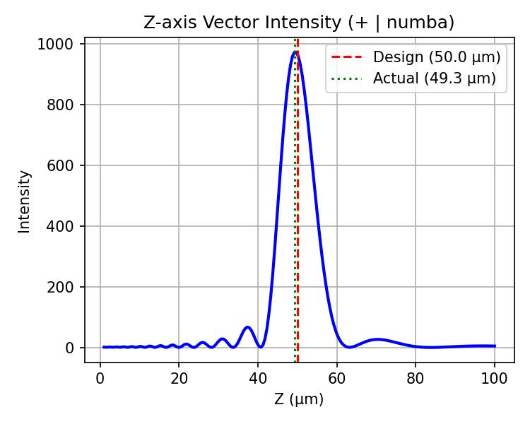
        <p style="margin-top: auto; padding-top: 10px; font-size: 0.9em; color: #333333;"><b>图 1.1a:</b> Z轴分布。准确聚焦于 50 μm 附近。</p>
    </div>
    <div style="display: flex; flex-direction: column; flex: 1; text-align: center; background-color: #ffffff; padding: 10px; border: 1px solid #eeeeee; border-radius: 8px;">
        
        <p style="margin-top: auto; padding-top: 10px; font-size: 0.9em; color: #333333;"><b>图 1.1b:</b> 焦平面分布。呈现矢量衍射下的光斑特性。</p>
    </div>
</div>
<div style="text-align: center; background-color: #ffffff; padding: 15px; border: 1px solid #eeeeee; border-radius: 8px; margin-bottom: 30px;">
    
    <p style="margin-top: 10px; font-size: 0.9em; color: #333333;"><b>图 1.1c:</b> XZ 传播截面。矢量场在传播过程中的聚焦沙漏形态。</p>
</div>


<h3 id="12-vectorized">1.2 Vectorized 矢量化模式 (mode='v')</h3>
<p>利用 Numpy 矢量计算的方式。依赖大内存服务器进行全分辨率三维矢量张量计算。</p>

```python
E_tot_z_v, _, _, _  = RayleighSommerfeld_Vector(lamb, x_n, y_n, E_near_x_plus, E_near_y_plus, 0.0, 0.0, z_scan, mode='v', software='+')
E_tot_xy_v, _, _, _ = RayleighSommerfeld_Vector(lamb, x_n, y_n, E_near_x_plus, E_near_y_plus, x_f_scan, x_f_scan, f_design, mode='v', software='+')
E_tot_xz_v, _, _, _ = RayleighSommerfeld_Vector(lamb, x_n, y_n, E_near_x_plus, E_near_y_plus, x_xz_scan, 0.0, z_scan, mode='v', software='+')
```

<div style="display: flex; justify-content: space-between; align-items: stretch; gap: 15px; margin-bottom: 15px;">
    <div style="display: flex; flex-direction: column; flex: 1; text-align: center; background-color: #ffffff; padding: 10px; border: 1px solid #eeeeee; border-radius: 8px;">
        
        <p style="margin-top: auto; padding-top: 10px; font-size: 0.9em; color: #333333;"><b>图 1.2a:</b> Z轴分布</p>
    </div>
    <div style="display: flex; flex-direction: column; flex: 1; text-align: center; background-color: #ffffff; padding: 10px; border: 1px solid #eeeeee; border-radius: 8px;">
        
        <p style="margin-top: auto; padding-top: 10px; font-size: 0.9em; color: #333333;"><b>图 1.2b:</b> 焦平面分布</p>
    </div>
</div>
<div style="text-align: center; background-color: #ffffff; padding: 15px; border: 1px solid #eeeeee; border-radius: 8px; margin-bottom: 30px;">
    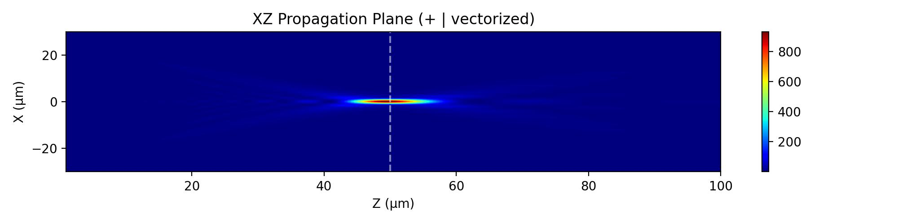
    <p style="margin-top: 10px; font-size: 0.9em; color: #333333;"><b>图 1.2c:</b> XZ 传播截面</p>
</div>


<h3 id="13-threaded">1.3 Threaded 多线程模式 (mode='t')</h3>
<p>基于 joblib 的进程级并行。</p>

```python
E_tot_z_t, _, _, _  = RayleighSommerfeld_Vector(lamb, x_n, y_n, E_near_x_plus, E_near_y_plus, 0.0, 0.0, z_scan, mode='t', software='+')
E_tot_xy_t, _, _, _ = RayleighSommerfeld_Vector(lamb, x_n, y_n, E_near_x_plus, E_near_y_plus, x_f_scan, x_f_scan, f_design, mode='t', software='+')
E_tot_xz_t, _, _, _ = RayleighSommerfeld_Vector(lamb, x_n, y_n, E_near_x_plus, E_near_y_plus, x_xz_scan, 0.0, z_scan, mode='t', software='+')
```

<div style="display: flex; justify-content: space-between; align-items: stretch; gap: 15px; margin-bottom: 15px;">
    <div style="display: flex; flex-direction: column; flex: 1; text-align: center; background-color: #ffffff; padding: 10px; border: 1px solid #eeeeee; border-radius: 8px;">
        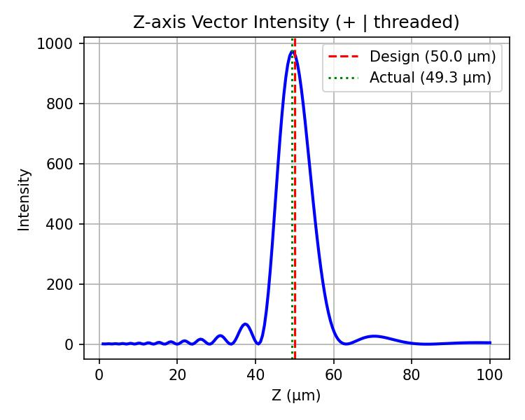
        <p style="margin-top: auto; padding-top: 10px; font-size: 0.9em; color: #333333;"><b>图 1.3a:</b> Z轴分布</p>
    </div>
    <div style="display: flex; flex-direction: column; flex: 1; text-align: center; background-color: #ffffff; padding: 10px; border: 1px solid #eeeeee; border-radius: 8px;">
        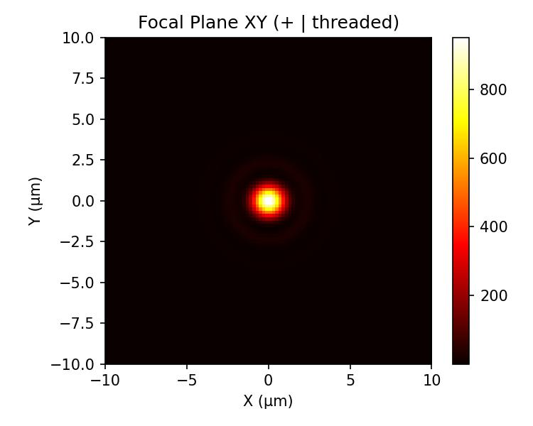
        <p style="margin-top: auto; padding-top: 10px; font-size: 0.9em; color: #333333;"><b>图 1.3b:</b> 焦平面分布</p>
    </div>
</div>
<div style="text-align: center; background-color: #ffffff; padding: 15px; border: 1px solid #eeeeee; border-radius: 8px; margin-bottom: 30px;">
    
    <p style="margin-top: 10px; font-size: 0.9em; color: #333333;"><b>图 1.3c:</b> XZ 传播截面</p>
</div>


<h3 id="14-common">1.4 Common 普通循环模式 (mode='c')</h3>
<p>纯 Python 嵌套循环，包含矢量耦合因子的计算，作为算法等价性验证的绝对基准。</p>

```python
E_tot_z_c, _, _, _  = RayleighSommerfeld_Vector(lamb, x_n, y_n, E_near_x_plus, E_near_y_plus, 0.0, 0.0, z_scan, mode='c', software='+')
E_tot_xy_c, _, _, _ = RayleighSommerfeld_Vector(lamb, x_n, y_n, E_near_x_plus, E_near_y_plus, x_f_scan, x_f_scan, f_design, mode='c', software='+')
E_tot_xz_c, _, _, _ = RayleighSommerfeld_Vector(lamb, x_n, y_n, E_near_x_plus, E_near_y_plus, x_xz_scan, 0.0, z_scan, mode='c', software='+')
```

<div style="display: flex; justify-content: space-between; align-items: stretch; gap: 15px; margin-bottom: 15px;">
    <div style="display: flex; flex-direction: column; flex: 1; text-align: center; background-color: #ffffff; padding: 10px; border: 1px solid #eeeeee; border-radius: 8px;">
        
        <p style="margin-top: auto; padding-top: 10px; font-size: 0.9em; color: #333333;"><b>图 1.4a:</b> Z轴分布</p>
    </div>
    <div style="display: flex; flex-direction: column; flex: 1; text-align: center; background-color: #ffffff; padding: 10px; border: 1px solid #eeeeee; border-radius: 8px;">
        
        <p style="margin-top: auto; padding-top: 10px; font-size: 0.9em; color: #333333;"><b>图 1.4b:</b> 焦平面分布</p>
    </div>
</div>
<div style="text-align: center; background-color: #ffffff; padding: 15px; border: 1px solid #eeeeee; border-radius: 8px; margin-bottom: 30px;">
    
    <p style="margin-top: 10px; font-size: 0.9em; color: #333333;"><b>图 1.4c:</b> XZ 传播截面</p>
</div>

---

<h2 id="2-minus">2. 第二组：负相位传播约定 (-)</h2>
<p>本组测试采用 <code>software='-'</code>，即空间相位传播项为 exp(-ikz)。为了匹配该约定，超透镜的设计相位翻转为正。</p>

```python
# 生成负相位约定下的近场矢量电场
phase_minus = k * np.sqrt(X_n**2 + Y_n**2 + f_design**2)
E_near_x_minus = aperture * np.exp(1j * phase_minus)
E_near_y_minus = np.zeros_like(E_near_x_minus)

# 显式指定 software='-'
E_tot_z_m, _, _, _  = RayleighSommerfeld_Vector(lamb, x_n, y_n, E_near_x_minus, E_near_y_minus, 0.0, 0.0, z_scan, mode='n', software='-')
E_tot_xy_m, _, _, _ = RayleighSommerfeld_Vector(lamb, x_n, y_n, E_near_x_minus, E_near_y_minus, x_f_scan, x_f_scan, f_design, mode='n', software='-')
E_tot_xz_m, _, _, _ = RayleighSommerfeld_Vector(lamb, x_n, y_n, E_near_x_minus, E_near_y_minus, x_xz_scan, 0.0, z_scan, mode='n', software='-')
```

<div style="display: flex; justify-content: space-between; align-items: stretch; gap: 15px; margin-bottom: 15px;">
    <div style="display: flex; flex-direction: column; flex: 1; text-align: center; background-color: #ffffff; padding: 10px; border: 1px solid #eeeeee; border-radius: 8px;">
        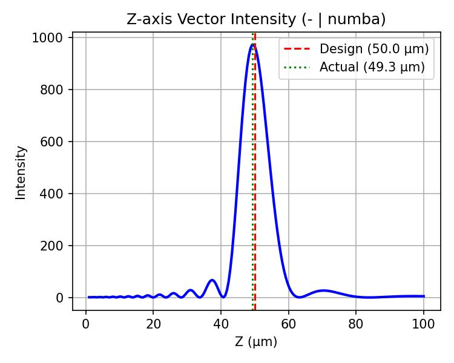
        <p style="margin-top: auto; padding-top: 10px; font-size: 0.9em; color: #333333;"><b>图 2.1a:</b> 负约定 Z 轴矢量光强。</p>
    </div>
    <div style="display: flex; flex-direction: column; flex: 1; text-align: center; background-color: #ffffff; padding: 10px; border: 1px solid #eeeeee; border-radius: 8px;">
        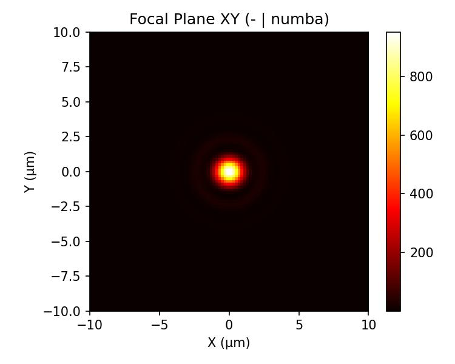
        <p style="margin-top: auto; padding-top: 10px; font-size: 0.9em; color: #333333;"><b>图 2.1b:</b> 负约定焦平面分布。结果不受数学符号干扰。</p>
    </div>
</div>
<div style="text-align: center; background-color: #ffffff; padding: 15px; border: 1px solid #eeeeee; border-radius: 8px; margin-bottom: 30px;">
    
    <p style="margin-top: 10px; font-size: 0.9em; color: #333333;"><b>图 2.1c:</b> 负约定 XZ 传播截面。</p>
</div>

---

<h2 id="3-diff">3. 第三组：误差分析与一致性验证</h2>
<p>基于矢量基尔霍夫核积分的数学等价性验证。</p>

<h3 id="31-mode-diff">3.1 不同计算模式差值分析</h3>
<p>展示了 Numba、Vectorized 和 Threaded 模式与基准 Common 模式计算出的矢量总光强差值。Colorbar 上限统一固定为 <code>1e-10</code>，验证了并行加速对各电场分量计算的精准无误。</p>

<div style="display: flex; justify-content: space-between; align-items: stretch; gap: 10px; margin-bottom: 30px;">
    <div style="display: flex; flex-direction: column; flex: 1; background-color: #ffffff; padding: 10px; border: 1px solid #eeeeee; border-radius: 8px;">
        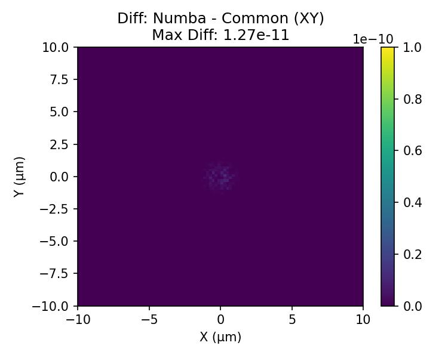
        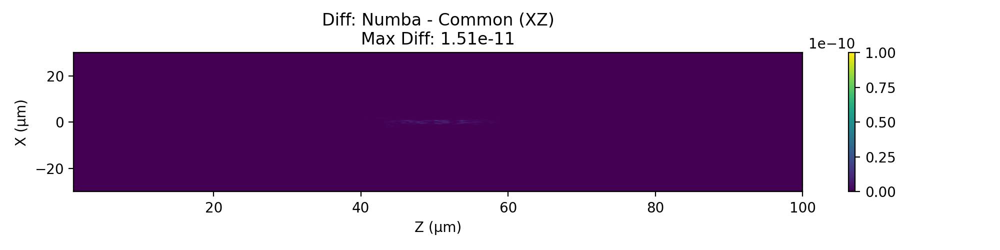
        <div style="margin-top: auto; padding-top: 15px; font-size: 0.85em; color: #333333;">
            <p style="margin: 0 0 5px 0;"><b>Numba - Common</b></p>
            <ul style="margin: 0; padding-left: 15px;">
                <li>XY 最大差值: 1.2733e-11, 平均差值: 4.2637e-14</li>
                <li>XZ 最大差值: 1.5120e-11, 平均差值: 3.2265e-14</li>
            </ul>
            <p style="margin: 10px 0 0 0; color: #666; text-align: center;">图 3.1a: Numba 模式差值</p>
        </div>
    </div>
    <div style="display: flex; flex-direction: column; flex: 1; background-color: #ffffff; padding: 10px; border: 1px solid #eeeeee; border-radius: 8px;">
        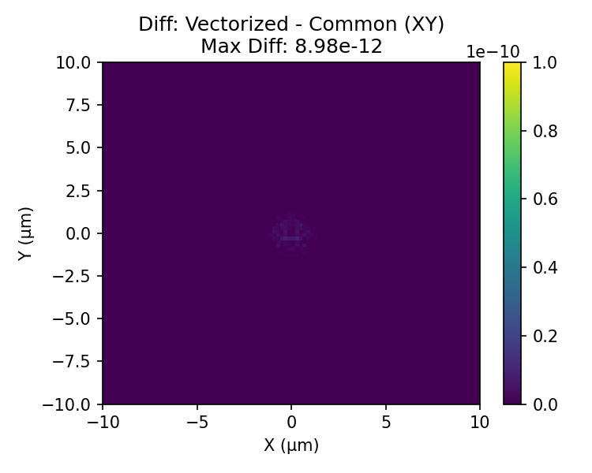
        
        <div style="margin-top: auto; padding-top: 15px; font-size: 0.85em; color: #333333;">
            <p style="margin: 0 0 5px 0;"><b>Vectorized - Common</b></p>
            <ul style="margin: 0; padding-left: 15px;">
                <li>XY 最大差值: 8.9813e-12, 平均差值: 3.0170e-14</li>
                <li>XZ 最大差值: 9.4360e-12, 平均差值: 2.2070e-14</li>
            </ul>
            <p style="margin: 10px 0 0 0; color: #666; text-align: center;">图 3.1b: 矢量化模式差值</p>
        </div>
    </div>
    <div style="display: flex; flex-direction: column; flex: 1; background-color: #ffffff; padding: 10px; border: 1px solid #eeeeee; border-radius: 8px;">
        
        
        <div style="margin-top: auto; padding-top: 15px; font-size: 0.85em; color: #333333;">
            <p style="margin: 0 0 5px 0;"><b>Threaded - Common</b></p>
            <ul style="margin: 0; padding-left: 15px;">
                <li>XY 最大差值: 9.5497e-12, 平均差值: 3.0486e-14</li>
                <li>XZ 最大差值: 9.7771e-12, 平均差值: 2.2102e-14</li>
            </ul>
            <p style="margin: 10px 0 0 0; color: #666; text-align: center;">图 3.1c: 多线程模式差值</p>
        </div>
    </div>
</div>

<h3 id="32-phase-diff">3.2 不同相位约定差值分析</h3>
<p>对于矢量衍射，不仅相位演化方向相反，核函数中的矢量耦合项同样依赖于传播方向因子 $sg$。下图证明了算法内部对相位约定的修正完美保证了最终能量场的一致性。</p>

<div style="display: flex; justify-content: space-between; align-items: stretch; gap: 15px; margin-bottom: 15px;">
    <div style="display: flex; flex-direction: column; flex: 1; text-align: center; background-color: #ffffff; padding: 10px; border: 1px solid #eeeeee; border-radius: 8px;">
        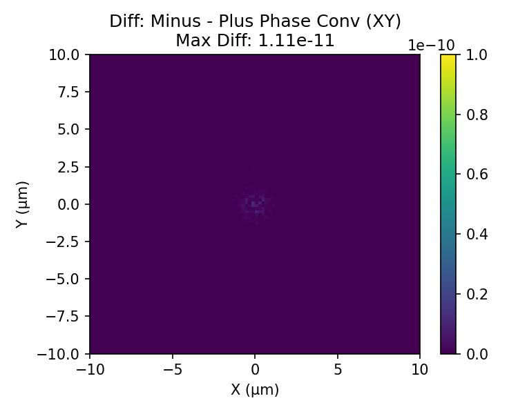
        <div style="margin-top: auto; padding-top: 15px; font-size: 0.85em; color: #333333; text-align: left;">
            <ul style="margin: 0; padding-left: 15px;">
                <li>XY 最大差值: 1.1141e-11, 平均差值: 3.0913e-14</li>
            </ul>
        </div>
        <p style="margin-top: 10px; font-size: 0.9em; color: #333333;"><b>图 3.2a:</b> 负约定 - 正约定 (XY平面)</p>
    </div>
    <div style="display: flex; flex-direction: column; flex: 1; text-align: center; background-color: #ffffff; padding: 10px; border: 1px solid #eeeeee; border-radius: 8px;">
        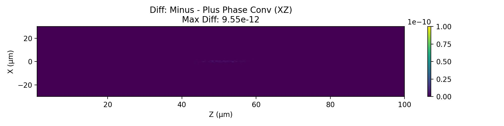
        <div style="margin-top: auto; padding-top: 15px; font-size: 0.85em; color: #333333; text-align: left;">
            <ul style="margin: 0; padding-left: 15px;">
                <li>XZ 最大差值: 9.5497e-12, 平均差值: 1.8737e-14</li>
            </ul>
        </div>
        <p style="margin-top: 10px; font-size: 0.9em; color: #333333;"><b>图 3.2b:</b> 负约定 - 正约定 (XZ截面)</p>
    </div>
</div>

---

## 4. 矢量衍射的独特性分析：高 NA 聚焦下的纵向场耦合

在低数值孔径（傍轴近似）下，标量衍射理论足够精确。然而，当透镜的 NA 增大（本例中 NA ≈ 0.51）时，光线向焦点汇聚的角度变大。对于 **X 线偏振** 的入射光，矢量衍射积分能够精确捕捉到以下标量理论无法预测的物理现象：

1. **纵向场 (Ez) 的产生**：虽然入射光是纯横向的 X 偏振，但在大角度聚焦时，为了满足电磁场散度为零（∇·E = 0）的物理约束，焦平面上沿 X 轴方向必然会产生两个对称的强纵向电场波瓣。
2. **主光斑非对称性**：由于 Ez 分量的能量叠加，总光强 (|E_total|²) 的焦点光斑不再是完美的圆形，而是沿着入射偏振方向（X轴）发生了一定程度的椭圆化拉伸。

*(注：由于超透镜等效为理想的平面标量相位掩膜，未引入导致去极化的 3D 折射界面或张量超原子，因此正交分量 Ey 在真空传播中严格保持为 0，这与 3D 曲面透镜的聚焦特性有所不同。)*

为了清晰展示这一特性，我们对焦平面中心区域进行了局部高分辨率扫描（范围缩减至 ±4 μm），独立提取并绘制了电场分量的光强分布。

<div style="display: flex; flex-wrap: wrap; justify-content: space-between; gap: 10px; margin-bottom: 30px;">
    <div style="display: flex; flex-direction: column; width: 32%; text-align: center; background-color: #ffffff; padding: 10px; border: 1px solid #eeeeee; border-radius: 8px;">
        
        <p style="margin-top: 10px; font-size: 0.9em; color: #333333;"><b>图 4.1a: 主偏振分量 |Ex|²</b><br>占据了绝大部分能量，光斑中心最亮。</p>
    </div>
    <div style="display: flex; flex-direction: column; width: 32%; text-align: center; background-color: #ffffff; padding: 10px; border: 1px solid #eeeeee; border-radius: 8px;">
        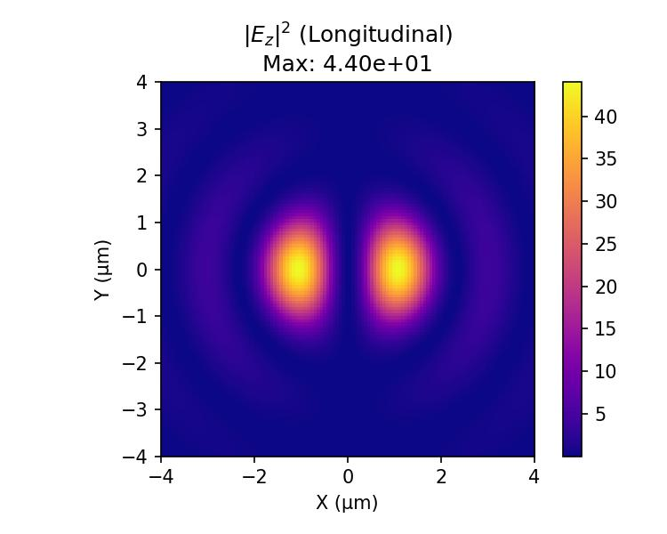
        <p style="margin-top: 10px; font-size: 0.9em; color: #333333;"><b>图 4.1b: 纵向偏振分量 |Ez|²</b><br>沿 X 轴分布的两个强波瓣，高 NA 聚焦的标志。</p>
    </div>
    <div style="display: flex; flex-direction: column; width: 32%; text-align: center; background-color: #ffffff; padding: 10px; border: 1px solid #eeeeee; border-radius: 8px;">
        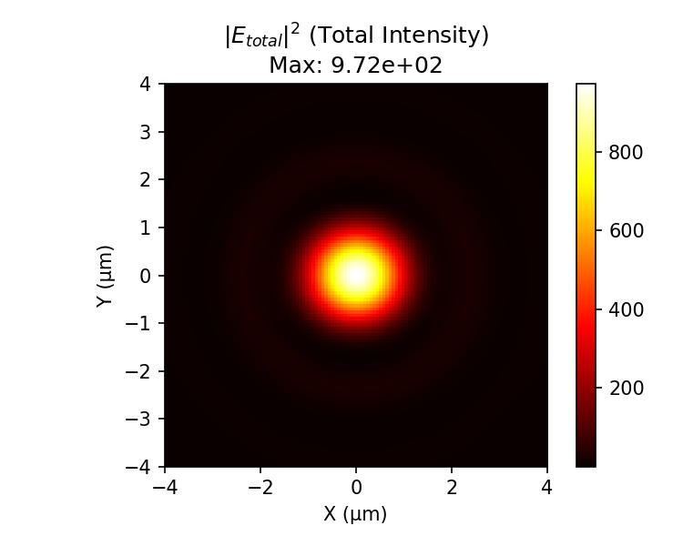
        <p style="margin-top: 10px; font-size: 0.9em; color: #333333;"><b>图 4.1c: 总光强 |E_total|²</b><br>叠加后，光斑沿 X 轴（偏振方向）略微拉长变宽。</p>
    </div>
</div>
